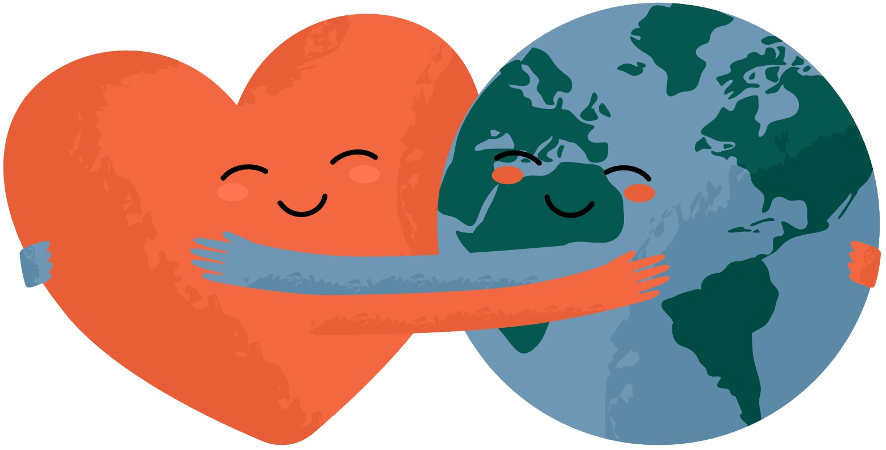

# CARE 
This repository is the official implementation of our paper: **[CARE: Aligning Language Models for Regional Cultural Awareness](https://arxiv.org/pdf/2311.04072.pdf)**. 


## CARE Datasets

You can download CARE resource in: [https://huggingface.co/datasets/geyang627/CARE](https://huggingface.co/datasets/geyang627/CARE). 

It includes responses with human ratings on culture-specific multilingual questions

Specifically, the `question` field is the culture-specific question, the `response` field contains responses generated by LLM (e.g. Qwen2.5-7B-Instruct) or written by human, the `culture_type` field contains cultural context category, `associated_culture` field contains the associated culture, and `rating` field contains the rating given by human on a 10-point scale, For a detailed description of the construction process of CARE, please refer to our paper.


## Culturally Aligned Models
We have released the culturally aligned models using CARE in: [geyang627/CARE](https://huggingface.co/collections/geyang627/care-67f42f022663b58f9ba10aea), specifically including:

You can use them directly as below.

```
from transformers import AutoModelForCausalLM, AutoTokenizer

tokenizer = AutoTokenizer.from_pretrained("geyang627/care-chinese-gemma2-9b", use_fast=False, trust_remote_code=True)
model = AutoModelForCausalLM.from_pretrained("geyang627/care-chinese-gemma2-9b")

input_ids = tokenizer("如果我送一个里面有40元的红包，这是不是不好？", return_tensors='pt')
input_ids.pop("token_type_ids")

pred_ids = model.generate(max_new_tokens=256, **input_ids)
print(tokenizer.batch_decode(pred_ids, skip_special_tokens=True))
```

## Evaluation
To evaluate model's cultural awareness with CARE, you can assess our test set in [geyang627/CARE-eval](https://huggingface.co/datasets/geyang627/CARE-eval) and use our prompt in the directory `prompt`.


## Acknowledgment
Please cite the following paper if you find our code or data helpful.

```
@article{guo2025care,
  title={CARE: Aligning Language Models for Regional Cultural Awareness},
  author={Guo, Geyang and Naous, Tarek and Wakaki, Hiromi and Nishimura, Yukiko and Mitsufuji, Yuki and Ritter, Alan and Xu, Wei},
  journal={arXiv preprint arXiv:2504.05154},
  year={2025}
}
```


